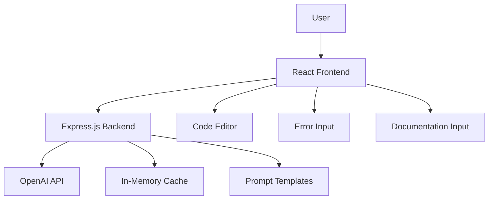

# Design Document

## Overview

CodeSaathi is designed as a simple client-server web application suitable for a student-level prototype. The frontend is built with React for an interactive user interface, while the backend uses Node.js with Express to handle API requests and integrate with AI services. The system uses OpenAI's API for code analysis and explanation, with custom prompts optimized for beginner-friendly explanations in Hinglish.

## Architecture

### High-Level Architecture



### Simple Data Flow


### Technology Stack

**Frontend:**

- React with JavaScript (keeping it simple)
- CSS modules for styling
- Basic textarea/Monaco Editor for code input
- Fetch API for HTTP requests

**Backend:**

- Node.js with Express.js
- Basic in-memory caching for repeated requests
- Environment variables for configuration
- Simple error handling middleware

**AI Integration:**

- OpenAI GPT-3.5-turbo API (cost-effective for prototype)
- Custom prompt templates for different use cases
- Basic retry logic for API failures

## Components and Interfaces

### Frontend Components

#### Main App Component

```javascript
// Simple React component structure
const App = () => {
  const [activeTab, setActiveTab] = useState("code");
  const [isLearningMode, setIsLearningMode] = useState(false);

  return (
    <div className="app">
      <Header />
      <TabNavigation activeTab={activeTab} onTabChange={setActiveTab} />
      <LearningModeToggle
        isEnabled={isLearningMode}
        onToggle={setIsLearningMode}
      />
      {activeTab === "code" && (
        <CodeExplainer isLearningMode={isLearningMode} />
      )}
      {activeTab === "error" && (
        <ErrorDebugger isLearningMode={isLearningMode} />
      )}
      {activeTab === "docs" && (
        <DocSummarizer isLearningMode={isLearningMode} />
      )}
    </div>
  );
};
```

#### Code Explainer Component

```javascript
const CodeExplainer = ({ isLearningMode }) => {
  const [code, setCode] = useState("");
  const [explanation, setExplanation] = useState(null);
  const [loading, setLoading] = useState(false);

  const handleExplain = async () => {
    setLoading(true);
    try {
      const response = await fetch("/api/explain-code", {
        method: "POST",
        headers: { "Content-Type": "application/json" },
        body: JSON.stringify({ code, isLearningMode }),
      });
      const result = await response.json();
      setExplanation(result);
    } catch (error) {
      console.error("Error explaining code:", error);
    }
    setLoading(false);
  };

  return (
    <div className="code-explainer">
      <textarea
        value={code}
        onChange={(e) => setCode(e.target.value)}
        placeholder="Paste your code here..."
      />
      <button onClick={handleExplain} disabled={loading}>
        {loading ? "Explaining..." : "Explain Code"}
      </button>
      {explanation && <ExplanationDisplay explanation={explanation} />}
    </div>
  );
};
```

### Backend API Structure

#### Main Server Setup

```javascript
const express = require("express");
const cors = require("cors");
const app = express();

app.use(cors());
app.use(express.json());

// Routes
app.post("/api/explain-code", explainCodeHandler);
app.post("/api/debug-error", debugErrorHandler);
app.post("/api/summarize-docs", summarizeDocsHandler);

const PORT = process.env.PORT || 3001;
app.listen(PORT, () => {
  console.log(`Server running on port ${PORT}`);
});
```

#### API Handlers

```javascript
const explainCodeHandler = async (req, res) => {
  try {
    const { code, isLearningMode } = req.body;

    // Validate input
    if (!code || code.trim().length === 0) {
      return res.status(400).json({ error: "Code is required" });
    }

    // Generate explanation using AI
    const explanation = await generateCodeExplanation(code, isLearningMode);

    res.json(explanation);
  } catch (error) {
    console.error("Error in explainCodeHandler:", error);
    res.status(500).json({ error: "Failed to explain code" });
  }
};
```

## Data Models

### Request/Response Models

```javascript
// Code Explanation Request
{
  code: string,
  language: 'javascript' | 'python',
  isLearningMode: boolean
}

// Code Explanation Response
{
  overallExplanation: string,
  lineByLine: [
    {
      lineNumber: number,
      code: string,
      explanation: string,
      concepts: string[]
    }
  ],
  suggestedConcepts: string[],
  difficulty: 'beginner' | 'intermediate' | 'advanced'
}

// Error Debug Request
{
  errorMessage: string,
  language: string,
  isLearningMode: boolean
}

// Error Debug Response
{
  simplifiedExplanation: string,
  possibleCauses: string[],
  suggestedFixes: string[],
  learningTips: string[]
}
```

## AI Service Integration

### Prompt Templates

```javascript
const promptTemplates = {
  codeExplanation: {
    basic: `Explain this code in simple terms for a beginner programmer. Use Hinglish (mix of Hindi and English) where helpful:

Code:
{code}

Provide:
1. Overall explanation
2. Line-by-line breakdown
3. Key programming concepts used`,

    learning: `Explain this code in detail for a student learning programming. Use Hinglish and include educational context:

Code:
{code}

Provide:
1. Detailed overall explanation
2. Line-by-line breakdown with concepts
3. Related programming concepts to learn next
4. Why this code pattern is useful`,
  },

  errorDebugging: `Convert this technical error into simple language for a beginner. Use Hinglish where helpful:

Error: {error}

Provide:
1. What went wrong in simple terms
2. Possible causes
3. Step-by-step fixes
4. Tips to avoid this error in future`,

  docSummarization: `Summarize this documentation for a beginner programmer. Use Hinglish where helpful:

Documentation:
{content}

Provide:
1. What this project/library does
2. Key features in simple terms
3. How to get started
4. Main concepts a beginner should know`,
};
```

### AI Service Functions

```javascript
const generateCodeExplanation = async (code, isLearningMode) => {
  const prompt = isLearningMode
    ? promptTemplates.codeExplanation.learning.replace("{code}", code)
    : promptTemplates.codeExplanation.basic.replace("{code}", code);

  const response = await openai.chat.completions.create({
    model: "gpt-3.5-turbo",
    messages: [{ role: "user", content: prompt }],
    max_tokens: 1000,
    temperature: 0.7,
  });

  return parseCodeExplanation(response.choices[0].message.content);
};
```

## Error Handling

### Frontend Error Handling

- Display user-friendly error messages
- Show loading states during API calls
- Handle network failures gracefully
- Provide retry options for failed requests

### Backend Error Handling

```javascript
const errorHandler = (err, req, res, next) => {
  console.error(err.stack);

  if (err.type === "validation") {
    return res.status(400).json({ error: err.message });
  }

  if (err.type === "ai_service") {
    return res
      .status(503)
      .json({ error: "AI service temporarily unavailable" });
  }

  res.status(500).json({ error: "Something went wrong" });
};
```

## Testing Strategy

### Frontend Testing

- Basic component testing with React Testing Library
- User interaction testing for main workflows
- Error state testing

### Backend Testing

- API endpoint testing with simple test cases
- AI integration testing with mock responses
- Error handling validation

### Manual Testing

- Test with various code samples
- Verify Hinglish explanations are appropriate
- Check learning mode differences
- Test error scenarios

## Security Considerations

### Basic Security Measures

- Input validation and sanitization
- Rate limiting to prevent abuse
- Environment variables for API keys
- CORS configuration
- Basic input size limits

### Data Privacy

- No persistent storage of user code
- Temporary in-memory caching only
- Clear session data after use
- No logging of sensitive user input

## Performance Optimization

### Simple Optimizations

- In-memory caching for repeated requests
- Debounced API calls to prevent spam
- Loading states for better user experience
- Basic error retry mechanisms
- Reasonable timeout limits for AI API calls
